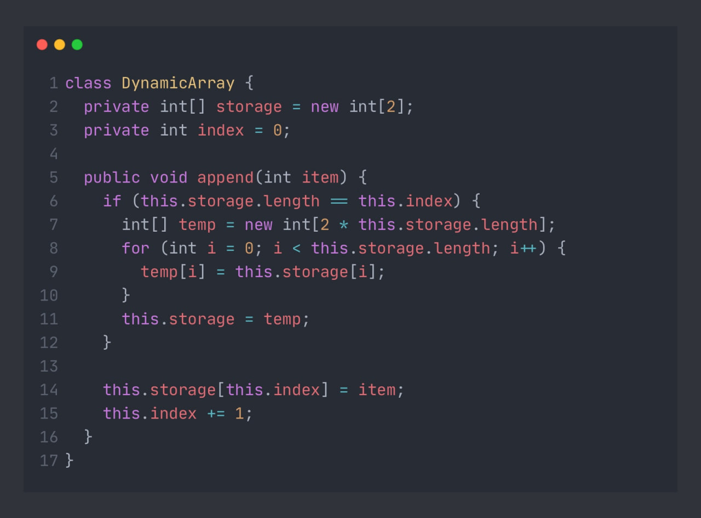

## Амортизационный анализ

Перед началом чтения этой статьи я предлагаю ответить на тест в [этом посте](https://t.me/iksergeyru/323).

Итак, давайте разберемся почему ответ именно такой.

Для начала обязательно ознакомьтесь с [вот этой публикацией](https://t.me/iksergeyru/121) или даже посмотрите [вот этот пост](https://t.me/iksergeyru/119) или вот этот [стрим на 6+ часов](https://boosty.to/ksergeyru/posts/5a984ee2-3862-43e5-8d3f-e4b93d9dc97a?share=post_link) где я выдаю всю базу **Асимптотической сложности алгоритмов**, после неё вы просто не можете не понять что же такое нотации:
 - **𝑂**, *O-большое*
 - **𝛀**, *омега-большое*
 - **𝚯**, *тета-большое*
 - **𝑜**, *o-малое*
 - **ω**, *омега-малое*



И почему в конкретно этом примере мы не можем использовать никакую из этих нотаций.

### § 1

Давайте попробуем порассуждать и как-то визуализировать процесс вставки элементов в представленном коде.

Договоримся "граничным" называть такой элемент, который ведёт к увеличению размера исходного массива.
Для простоты иллюстрации пусть изначальный массив будет состоять не из двух элементов `int[] storage = new int [2];`, а из нуля – `int[] storage = new int [0];`
Это никак не влияет на логику работы кода, но сильно упрощает процесс подсчёта.

На примере вставки от 0 до 32, покажем зависимость количества копирований от индекса элемента.

Для:
```
 1 - 1 т е добавление одного элемента на индекс `1` приведёт к созданию нового массива и копирования одного элемента.
 2 - 2 копирования, это элементы на позициях 0 и 1
 3 - 0 копирований, новый массив не создаётся
 4 - 4 копирования, это элементы на позициях 0, 1, 2, 3
 5 - 0 копирований, новый массив не создаётся
 6 - 0 копирований, новый массив не создаётся
 7 - 0 копирований, новый массив не создаётся
 8 - 8 копирований
 9 - 0 копирований
10 - 0 копирований
11 - 0 копирований
12 - 0 копирований
13 - 0 копирований
13 - 0 копирований
14 - 0 копирований
15 - 0 копирований
16 - 16 копирований
17-31 -  0 копирований
32 - 32 копирования
и так далее
```
0 копирований нас не особо интересуют, поэтому на эти показания не будем обращать внимание, а остальные результаты представим степенями двойки:

$$1: 1  = 2^0$$
$$2: 2  = 2^1$$
$$4: 4  = 2^2$$
$$8: 8  = 2^3$$
$$16: 16  = 2^4$$
$$32: 32  = 2^5$$
и так далее, когда-то мы дойдём до некого $N$-ого элемента, и тогда сложность вставки этого элемента можно представить так:

$$N = 2^k \space\space\space{{Ф.1}}$$

| Индекс элемента  | Кол-во копирований| Сложность вставки |
| ------------- |:------------------:| ---------:|
| 0             | $0$                | $0+1$     |
| 1             | $2^0$              | $2^0+1$   |
| 2             | $2^1$              | $2^1+1$   |
| 3             | $0$                | $0+1$     |
| 4             | $2^2$              | $2^2+1$   |
| 5             | $0$                | $0+1$     |
| 6             | $0$                | $0+1$     |
| 7             | $0$                | $0+1$     |
| 8             | $2^3$              | $2^3+1$   |
| ...           | $0$                | $0+1$     |
| 16            | $2^4$              | $2^4+1$   |
| 32            | $2^5$              | $2^5+1$   |
| ...           | $0$                | $0+1$     |
| $N$           | $2^k$              | $2^k+1$   |

Замечание: Почему здесь нельзя применять, например, нотацию "O-большое"? Потому что фактически вставка элементов, отличных от позиций, равных степеням двойки, равна $O(1)$, в остальных случаях она равна позиции элемента.\
Чем больше индекс, тем реже операция копирования элемента. Тем самым, если допустить, что сложность вставки $O(n)$ (как изначально может показаться), то посчитаем количество копирований при вставке элементов на позиции от 536 870 913 ($2^{29} + 1$) до 1 073 741 823 ($2^{30} - 1$). Очевидно, что копирование 536 870 911 элементов не приведёт ни к одной операции копирования массива, а значит сложность добавления на этом промежутке будет $O(1)$.

Получается, что в третьем столбце таблицы находится общее количество операций копирования, плюс вставка самих элементов. Другими словами, сумма всех элементов столбца даёт сложность вставки последовательности из $N$ элементов.

Найдём сумму всех элементов третьего столбца:

$(1)+(2^0+1)+(2^1+1)+(1)+(2^2+1)+...+(2^k+1) = $
$2^0+2^1+2^2+...+2^k+(N+1)$

*Нумерация с 0, последний элемент находится на $N$-й позиции, значит всего будет $N+1$ строка.*

Таким образом сумма элементов третьей строки равна:

$$[2^0+2^1+...+2^k]+[N+1]$$

Сумма $2^0+2^1+...+2^k = 1+2+4+8+...+2^k$ – это сумма элементов геометрической прогрессии и она равна:

$$2^{k+1}-1$$

Тогда сумма всего ряда равна:
$$2^{k+1}-1 + N+1$$

Преобразуем:

$$2^{k+1}-1 + N+1 = 2 * 2^k-1+N+1\space\space\space{{Ф.2}}$$
Как мы помним из Ф.1, $2^k = N$, таким образом, Ф.2 превращается в:
$$2 * N+N+1-1 = 3N\space\space\space{{Ф.3}}$$

Получается, что сложность вставки последовательности из $N$ элементов сводится к асимптотической сложности $O(N)$.

Как мы помним, сложность добавления элементов в массив не равномерна и очень сильно зависит от позиции. В таких случаях на помощь приходит **амортизационный анализ**.

В контексте программирования термин "амортизационный анализ" может использоваться для оценки времени выполнения операций или алгоритмов с учетом их средней производительности на протяжении времени. Этот анализ позволяет оценить среднюю стоимость выполнения операций в течение большого числа запросов или итераций.

Обозначим за $A_s$ – амортизационную сложность одного вызова.
$$
A_s=\frac{Асимптотическая \space сложность}{Общее \space количество \space вызовов}
$$

Таким образом, амортизационная сложность добавления одного элемента алгоритмом, представленным в коде 

$$
A_s=\frac{O(N)}{N} = O(1)
$$

Итог:
- амортизационная сложность вставки одного элемента при добавлении последовательности элементов равна $O(1)$, но сложность вставки одного элемента может быть как $O(1)$, так и $O(N)$ то есть однозначного ответа нет
- не всегда можно определить сложность алгоритма используя нотацию О-большое (или другие), поэтому для таких целей существует амортизационный анализ.

ps: пригодится ли вам это когда-нибудь? Думаю, выкладки не пригодятся никогда, а вот вопрос на собеседовании "какая сложность вставки элемента в `List<T>` в `C#` или `ArrayList<T>` в `Java` получить можно.
